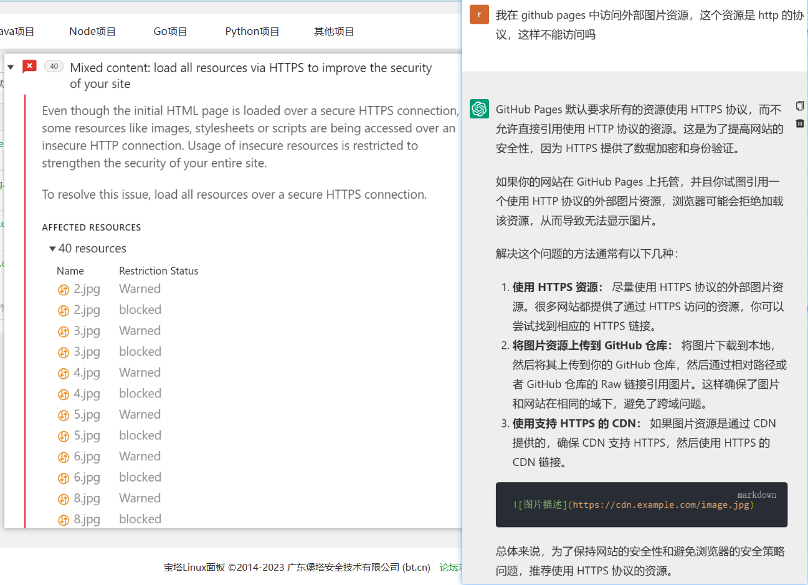

# This is a good start build on vuepress of my blog
> 这是博客的首页
<<<<<<< HEAD

> Schedule

1. 首页需要再完善一下，做好看些
2. 未来打算把 Tpora 的图片都用服务器图床的，准备做一个图片上传的网站专门传到我的服务器中，并且返回图片路径
   1. 还有一个问题是现在存在服务器的图片太大了，1核2g的服务器加载图片实在是太慢了，想想办法怎么样快速加载出来吧！
   2. 还有一个问题是 Typora 的图片直接把文档都撑开了，太大了，要怎么才能让它变得格式适合呢？这个也去研究一下！
   3. 我的博客能直接看到我的图片部署的端口，这样会不会导致被攻击呢？毕竟端口号给暴露出来了！
   ---

3. 因为图床有一个问题是通过 github 的服务器访问我阿里云的服务器资源，似乎会产生跨域问题导致无法获取图片，这个尝试将阿里云的站点设置跨域访问也没有用，不知道为什么   :+1::+1::+1:
      1. 问题似乎找到了，是因为 github 的站点默认不允许访问 http 的资源，这是为了安全。所以为了能过访这个资源，要么把网站 https 整上或者绑定CDN，要么就把图片放在 github 上托管，我选择了后者

=======
1. 首页需要再完善一下，做好看些
2. 接下来准备玩一下 flutter ，用之前看的 结构树 的方式了解 flutter！
>>>>>>> c21ec8ce7999b953865e1af1d77abfc0e57caf47
